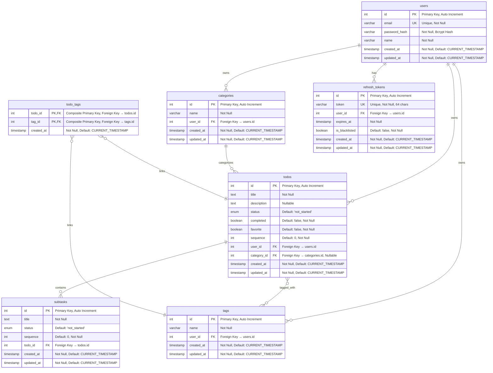

# Database Entity Relationship Diagram (ERD)

## Todo Application Database Schema

This document provides a comprehensive Entity Relationship Diagram (ERD) for the Todo Application database, showing all tables, relationships, indexes, and constraints.

## Database Overview

The Todo Application uses a PostgreSQL database with 6 main entities:
- **Users** - User accounts and authentication
- **Categories** - Todo categorization system
- **Tags** - Todo tagging system (many-to-many)
- **Todos** - Main todo items
- **Subtasks** - Todo subtasks and checklist items
- **RefreshTokens** - JWT refresh token management

## ERD Diagram



## Detailed Table Specifications

### 1. Users Table
```sql
CREATE TABLE users (
    id SERIAL PRIMARY KEY,
    email VARCHAR(255) UNIQUE NOT NULL,
    password_hash VARCHAR(255) NOT NULL,
    name VARCHAR(255) NOT NULL,
    created_at TIMESTAMP DEFAULT CURRENT_TIMESTAMP NOT NULL,
    updated_at TIMESTAMP DEFAULT CURRENT_TIMESTAMP NOT NULL
);

-- Indexes
CREATE INDEX idx_users_email ON users(email);
```

**Business Rules:**
- Email must be unique across the system
- Password is hashed using bcrypt with 12 salt rounds
- Name and email are required fields
- Email is normalized to lowercase

### 2. Categories Table
```sql
CREATE TABLE categories (
    id SERIAL PRIMARY KEY,
    name VARCHAR(255) NOT NULL,
    user_id INTEGER NOT NULL REFERENCES users(id) ON DELETE CASCADE,
    created_at TIMESTAMP DEFAULT CURRENT_TIMESTAMP NOT NULL,
    updated_at TIMESTAMP DEFAULT CURRENT_TIMESTAMP NOT NULL
);

-- Indexes
CREATE INDEX idx_categories_user_id ON categories(user_id);
CREATE UNIQUE INDEX idx_categories_user_name ON categories(user_id, name);
```

**Business Rules:**
- Category names must be unique per user
- Categories are deleted when the user is deleted (CASCADE)
- User can have unlimited categories

### 3. Tags Table
```sql
CREATE TABLE tags (
    id SERIAL PRIMARY KEY,
    name VARCHAR(255) NOT NULL,
    user_id INTEGER NOT NULL REFERENCES users(id) ON DELETE CASCADE,
    created_at TIMESTAMP DEFAULT CURRENT_TIMESTAMP NOT NULL,
    updated_at TIMESTAMP DEFAULT CURRENT_TIMESTAMP NOT NULL
);

-- Indexes
CREATE INDEX idx_tags_user_id ON tags(user_id);
CREATE UNIQUE INDEX idx_tags_user_name ON tags(user_id, name);
```

**Business Rules:**
- Tag names must be unique per user
- Tags are deleted when the user is deleted (CASCADE)
- Tags have many-to-many relationship with todos

### 4. Todos Table
```sql
CREATE TABLE todos (
    id SERIAL PRIMARY KEY,
    title TEXT NOT NULL,
    description TEXT,
    status ENUM('not_started', 'in_progress', 'on_hold', 'completed') DEFAULT 'not_started',
    completed BOOLEAN DEFAULT false NOT NULL,
    favorite BOOLEAN DEFAULT false NOT NULL,
    sequence INTEGER DEFAULT 0 NOT NULL,
    user_id INTEGER NOT NULL REFERENCES users(id) ON DELETE CASCADE,
    category_id INTEGER REFERENCES categories(id) ON DELETE SET NULL,
    created_at TIMESTAMP DEFAULT CURRENT_TIMESTAMP NOT NULL,
    updated_at TIMESTAMP DEFAULT CURRENT_TIMESTAMP NOT NULL
);

-- Indexes
CREATE INDEX idx_todos_user_id ON todos(user_id);
CREATE INDEX idx_todos_category_id ON todos(category_id);
CREATE INDEX idx_todos_completed ON todos(completed);
CREATE INDEX idx_todos_favorite ON todos(favorite);
CREATE INDEX idx_todos_sequence ON todos(sequence);
CREATE INDEX idx_todos_created_at ON todos(created_at);
CREATE INDEX idx_todos_status ON todos(status);
```

**Business Rules:**
- Title is required, description is optional
- Status enum: 'not_started' | 'in_progress' | 'on_hold' | 'completed'
- Completed and favorite are boolean flags
- Sequence is used for user-defined ordering
- Category is optional (nullable foreign key)
- When category is deleted, todos become uncategorized (SET NULL)

### 5. Subtasks Table
```sql
CREATE TABLE subtasks (
    id SERIAL PRIMARY KEY,
    title TEXT NOT NULL,
    status ENUM('not_started', 'in_progress', 'on_hold', 'completed') DEFAULT 'not_started',
    sequence INTEGER DEFAULT 0 NOT NULL,
    todo_id INTEGER NOT NULL REFERENCES todos(id) ON DELETE CASCADE,
    created_at TIMESTAMP DEFAULT CURRENT_TIMESTAMP NOT NULL,
    updated_at TIMESTAMP DEFAULT CURRENT_TIMESTAMP NOT NULL
);

-- Indexes
CREATE INDEX idx_subtasks_todo_id ON subtasks(todo_id);
CREATE INDEX idx_subtasks_status ON subtasks(status);
CREATE INDEX idx_subtasks_sequence ON subtasks(sequence);
```

**Business Rules:**
- Subtasks belong to a parent todo
- Title is required
- Status matches todo status enum
- Sequence is used for ordering within a todo
- Subtasks are deleted when parent todo is deleted (CASCADE)

### 6. Todo Tags Junction Table
```sql
CREATE TABLE todo_tags (
    todo_id INTEGER NOT NULL REFERENCES todos(id) ON DELETE CASCADE,
    tag_id INTEGER NOT NULL REFERENCES tags(id) ON DELETE CASCADE,
    created_at TIMESTAMP DEFAULT CURRENT_TIMESTAMP NOT NULL,
    PRIMARY KEY (todo_id, tag_id)
);

-- Indexes
CREATE INDEX idx_todo_tags_todo_id ON todo_tags(todo_id);
CREATE INDEX idx_todo_tags_tag_id ON todo_tags(tag_id);
```

**Business Rules:**
- Many-to-many relationship between todos and tags
- Composite primary key prevents duplicate relationships
- Relationships are deleted when either todo or tag is deleted (CASCADE)

### 7. Refresh Tokens Table
```sql
CREATE TABLE refresh_tokens (
    id SERIAL PRIMARY KEY,
    token VARCHAR(64) UNIQUE NOT NULL,
    user_id INTEGER NOT NULL REFERENCES users(id) ON DELETE CASCADE,
    expires_at TIMESTAMP NOT NULL,
    is_blacklisted BOOLEAN DEFAULT false NOT NULL,
    created_at TIMESTAMP DEFAULT CURRENT_TIMESTAMP NOT NULL,
    updated_at TIMESTAMP DEFAULT CURRENT_TIMESTAMP NOT NULL
);

-- Indexes
CREATE INDEX idx_refresh_tokens_token ON refresh_tokens(token);
CREATE INDEX idx_refresh_tokens_user_id ON refresh_tokens(user_id);
CREATE INDEX idx_refresh_tokens_expires_at ON refresh_tokens(expires_at);
```

**Business Rules:**
- Tokens are unique across the system
- Token length is fixed at 64 characters
- Tokens have expiration dates
- Blacklisted tokens are invalid but kept for audit
- Tokens are deleted when user is deleted (CASCADE)

## Relationship Details

### One-to-Many Relationships

1. **Users → Categories** (1:N)
   - One user can have many categories
   - Categories are user-specific and private

2. **Users → Tags** (1:N)
   - One user can have many tags
   - Tags are user-specific and private

3. **Users → Todos** (1:N)
   - One user can have many todos
   - Todos are user-specific and private

4. **Users → RefreshTokens** (1:N)
   - One user can have multiple active refresh tokens
   - Supports multiple device login

5. **Categories → Todos** (1:N)
   - One category can contain many todos
   - Todos can be uncategorized (null category)

6. **Todos → Subtasks** (1:N)
   - One todo can have many subtasks
   - Subtasks belong to exactly one todo

### Many-to-Many Relationships

1. **Todos ↔ Tags** (N:M)
   - One todo can have multiple tags
   - One tag can be applied to multiple todos
   - Implemented via `todo_tags` junction table

## Database Constraints

### Primary Keys
- All tables have auto-incrementing integer primary keys
- `todo_tags` uses composite primary key (todo_id, tag_id)

### Foreign Keys
- **categories.user_id** → users.id (CASCADE DELETE)
- **tags.user_id** → users.id (CASCADE DELETE)
- **todos.user_id** → users.id (CASCADE DELETE)
- **todos.category_id** → categories.id (SET NULL DELETE)
- **subtasks.todo_id** → todos.id (CASCADE DELETE)
- **todo_tags.todo_id** → todos.id (CASCADE DELETE)
- **todo_tags.tag_id** → tags.id (CASCADE DELETE)
- **refresh_tokens.user_id** → users.id (CASCADE DELETE)

### Unique Constraints
- **users.email** - System-wide unique
- **refresh_tokens.token** - System-wide unique
- **categories(user_id, name)** - Unique category names per user
- **tags(user_id, name)** - Unique tag names per user
- **todo_tags(todo_id, tag_id)** - Prevent duplicate tag assignments

### Check Constraints
- **todos.status** - Must be valid enum value
- **subtasks.status** - Must be valid enum value

## Database Indexes

### Performance Indexes
```sql
-- User lookups
CREATE INDEX idx_users_email ON users(email);

-- Category operations
CREATE INDEX idx_categories_user_id ON categories(user_id);

-- Tag operations  
CREATE INDEX idx_tags_user_id ON tags(user_id);

-- Todo queries
CREATE INDEX idx_todos_user_id ON todos(user_id);
CREATE INDEX idx_todos_category_id ON todos(category_id);
CREATE INDEX idx_todos_completed ON todos(completed);
CREATE INDEX idx_todos_favorite ON todos(favorite);
CREATE INDEX idx_todos_sequence ON todos(sequence);
CREATE INDEX idx_todos_status ON todos(status);
CREATE INDEX idx_todos_created_at ON todos(created_at);

-- Subtask queries
CREATE INDEX idx_subtasks_todo_id ON subtasks(todo_id);
CREATE INDEX idx_subtasks_status ON subtasks(status);
CREATE INDEX idx_subtasks_sequence ON subtasks(sequence);

-- Tag relationships
CREATE INDEX idx_todo_tags_todo_id ON todo_tags(todo_id);
CREATE INDEX idx_todo_tags_tag_id ON todo_tags(tag_id);

-- Token management
CREATE INDEX idx_refresh_tokens_token ON refresh_tokens(token);
CREATE INDEX idx_refresh_tokens_user_id ON refresh_tokens(user_id);
CREATE INDEX idx_refresh_tokens_expires_at ON refresh_tokens(expires_at);
```

## Data Types and Storage

### Enum Types
```sql
-- Status enum for todos and subtasks
CREATE TYPE status_enum AS ENUM (
    'not_started',
    'in_progress', 
    'on_hold',
    'completed'
);
```

### Storage Considerations
- **TEXT** columns for title/description (unlimited length)
- **VARCHAR(255)** for names and emails (reasonable limits)
- **VARCHAR(64)** for refresh tokens (fixed length)
- **TIMESTAMP** with timezone support
- **INTEGER** for all ID fields and sequences
- **BOOLEAN** for flags (completed, favorite, is_blacklisted)

## Security Features

### Data Protection
1. **Password Hashing**: bcrypt with 12 salt rounds
2. **Token Security**: 64-character random refresh tokens
3. **User Isolation**: All user data is isolated by user_id
4. **Cascade Deletes**: Proper cleanup when users are deleted

### Access Control
1. **User Ownership**: All entities belong to specific users
2. **Private Data**: No cross-user data access
3. **Token Expiration**: Refresh tokens have expiration dates
4. **Token Blacklisting**: Invalid tokens are blacklisted, not deleted

## Migration History

The database schema is managed through Sequelize migrations:

1. **20250613154321-create-users-table.js** - Users table
2. **20250613154322-create-categories-table.js** - Categories table  
3. **20250613154323-create-tags-table.js** - Tags table
4. **20250613160145-create-todos-table.js** - Todos table
5. **20250613160209-create-subtasks-table.js** - Subtasks table
6. **20250613160226-create-todo-tags-table.js** - Todo-Tags junction table
7. **20250614104726-create-refresh-tokens-table.js** - Refresh tokens table

## Example Queries

### Common Query Patterns

#### Get User's Todos with Categories and Tags
```sql
SELECT 
    t.*,
    c.name as category_name,
    array_agg(tag.name) as tag_names
FROM todos t
LEFT JOIN categories c ON t.category_id = c.id
LEFT JOIN todo_tags tt ON t.id = tt.todo_id
LEFT JOIN tags tag ON tt.tag_id = tag.id
WHERE t.user_id = $1
GROUP BY t.id, c.name
ORDER BY t.sequence ASC;
```

#### Get Todo with Subtasks and Completion Stats
```sql
SELECT 
    t.*,
    COUNT(s.id) as total_subtasks,
    COUNT(CASE WHEN s.status = 'completed' THEN 1 END) as completed_subtasks
FROM todos t
LEFT JOIN subtasks s ON t.id = s.todo_id
WHERE t.id = $1 AND t.user_id = $2
GROUP BY t.id;
```

#### Search Todos by Title or Description
```sql
SELECT DISTINCT t.*
FROM todos t
LEFT JOIN categories c ON t.category_id = c.id
LEFT JOIN todo_tags tt ON t.id = tt.todo_id
LEFT JOIN tags tag ON tt.tag_id = tag.id
WHERE t.user_id = $1
AND (
    t.title ILIKE '%' || $2 || '%' 
    OR t.description ILIKE '%' || $2 || '%'
    OR c.name ILIKE '%' || $2 || '%'
    OR tag.name ILIKE '%' || $2 || '%'
)
ORDER BY t.created_at DESC;
```

This ERD represents a well-structured, normalized database design that supports the full functionality of the Todo application while maintaining data integrity and performance.
