# 📝 Todo Management Application

A comprehensive, full-stack todo management system built with modern technologies, featuring user authentication, categories, tags, subtasks, and a beautiful user interface.

## 🎥 Demo Video

[**Watch the Live Demo**](https://vimeo.com/1093497129?share=copy#t=0) - See the application in action!

## ✨ Features

-   🔐 **Secure Authentication** - JWT with refresh tokens and httpOnly cookies
-   📋 **Todo Management** - Create, update, delete, and organize todos
-   🏷️ **Categories & Tags** - Flexible organization system
-   ✅ **Subtasks** - Break down complex todos into manageable steps
-   🔍 **Search & Filter** - Find todos quickly with powerful search
-   📊 **Status Tracking** - Track progress with multiple status states
-   📱 **Responsive Design** - Works seamlessly on all devices
-   🚀 **Real-time Updates** - Smooth user experience with optimistic updates
-   📄 **Pagination** - Handle large datasets efficiently

## 🛠️ Tech Stack

### Frontend

-   **React** - Modern UI library
-   **TypeScript** - Type-safe development
-   **Tailwind CSS** - Utility-first styling
-   **shadcn/ui** - Beautiful component library
-   **Axios** - HTTP client with interceptors

### Backend

-   **Node.js** - Runtime environment
-   **Express.js** - Web framework
-   **TypeScript** - Type-safe server development
-   **Sequelize** - ORM for database operations
-   **PostgreSQL** - Primary database
-   **JWT** - Authentication tokens
-   **bcrypt** - Password hashing

## 📊 Database Schema

```mermaid
erDiagram
    users {
        int id PK "Primary Key, Auto Increment"
        varchar email UK "Unique, Not Null"
        varchar password_hash "Not Null, Bcrypt Hash"
        varchar name "Not Null"
        timestamp created_at "Not Null, Default: CURRENT_TIMESTAMP"
        timestamp updated_at "Not Null, Default: CURRENT_TIMESTAMP"
    }

    categories {
        int id PK "Primary Key, Auto Increment"
        varchar name "Not Null"
        int user_id FK "Foreign Key → users.id"
        timestamp created_at "Not Null, Default: CURRENT_TIMESTAMP"
        timestamp updated_at "Not Null, Default: CURRENT_TIMESTAMP"
    }

    tags {
        int id PK "Primary Key, Auto Increment"
        varchar name "Not Null"
        int user_id FK "Foreign Key → users.id"
        timestamp created_at "Not Null, Default: CURRENT_TIMESTAMP"
        timestamp updated_at "Not Null, Default: CURRENT_TIMESTAMP"
    }

    todos {
        int id PK "Primary Key, Auto Increment"
        text title "Not Null"
        text description "Nullable"
        enum status "Default: 'not_started'"
        boolean completed "Default: false, Not Null"
        boolean favorite "Default: false, Not Null"
        int sequence "Default: 0, Not Null"
        int user_id FK "Foreign Key → users.id"
        int category_id FK "Foreign Key → categories.id, Nullable"
        timestamp created_at "Not Null, Default: CURRENT_TIMESTAMP"
        timestamp updated_at "Not Null, Default: CURRENT_TIMESTAMP"
    }

    subtasks {
        int id PK "Primary Key, Auto Increment"
        text title "Not Null"
        enum status "Default: 'not_started'"
        int sequence "Default: 0, Not Null"
        int todo_id FK "Foreign Key → todos.id"
        timestamp created_at "Not Null, Default: CURRENT_TIMESTAMP"
        timestamp updated_at "Not Null, Default: CURRENT_TIMESTAMP"
    }

    todo_tags {
        int todo_id PK,FK "Composite Primary Key, Foreign Key → todos.id"
        int tag_id PK,FK "Composite Primary Key, Foreign Key → tags.id"
        timestamp created_at "Not Null, Default: CURRENT_TIMESTAMP"
    }

    refresh_tokens {
        int id PK "Primary Key, Auto Increment"
        varchar token UK "Unique, Not Null, 64 chars"
        int user_id FK "Foreign Key → users.id"
        timestamp expires_at "Not Null"
        boolean is_blacklisted "Default: false, Not Null"
        timestamp created_at "Not Null, Default: CURRENT_TIMESTAMP"
        timestamp updated_at "Not Null, Default: CURRENT_TIMESTAMP"
    }

    %% Relationships
    users ||--o{ categories : "owns"
    users ||--o{ tags : "owns"
    users ||--o{ todos : "owns"
    users ||--o{ refresh_tokens : "has"

    categories ||--o{ todos : "categorizes"

    todos ||--o{ subtasks : "contains"
    todos }o--o{ tags : "tagged_with"

    todo_tags }o--|| todos : "links"
    todo_tags }o--|| tags : "links"
```



### Database Relationships

-   **Users** have many **Todos**, **Categories**, **Tags**, and **Refresh Tokens**
-   **Categories** can contain many **Todos** (optional relationship)
-   **Todos** have many **Subtasks** and can be tagged with many **Tags**
-   **Tags** can be applied to many **Todos** (many-to-many via junction table)
-   **Refresh Tokens** belong to **Users** for authentication management

## 🚀 Quick Start

### Prerequisites

-   Node.js 18+
-   PostgreSQL 13+
-   npm or yarn

### Installation

1. **Clone the repository**

    ```bash
    git clone <repository-url>
    cd todo-app
    ```

2. **Install dependencies**

    ```bash
    # Backend
    cd server
    npm install

    # Frontend
    cd ../client
    npm install
    ```

3. **Environment Setup**

    Create `.env` files:

    **Server (.env):**

    ```env
    # Database
    DB_HOST=localhost
    DB_PORT=5432
    DB_NAME=todoapp
    DB_USERNAME=your_username
    DB_PASSWORD=your_password

    # JWT
    JWT_SECRET=your-super-secret-jwt-key
    JWT_REFRESH_SECRET=your-refresh-secret-key
    JWT_EXPIRY=15m
    JWT_REFRESH_EXPIRY=7d

    # Server
    PORT=3000
    NODE_ENV=development

    # CORS
    CLIENT_URL=http://localhost:3001
    ```

    **Client (.env):**

    ```env
    VITE_API_BASE_URL=http://localhost:3000/api
    ```

4. **Database Setup**

    ```bash
    cd server

    # Create database
    createdb todoapp

    # Run migrations
    npm run migrate

    # Optional: Seed data
    npm run seed
    ```

5. **Start the application**

    ```bash
    # Start backend (Terminal 1)
    cd server
    npm run dev

    # Start frontend (Terminal 2)
    cd client
    npm run dev
    ```

6. **Access the application**
    - Frontend: http://localhost:3001
    - Backend API: http://localhost:3000
    - API Health: http://localhost:3000/api/health

## 📚 API Documentation

### Base URL

```
http://localhost:3000/api
```

### Authentication

All endpoints except authentication routes require a valid JWT access token in the `Authorization: Bearer <token>` header.

#### Authentication Flow

1. **Register/Login** → Receive access token + httpOnly refresh token cookie
2. **Make requests** → Include `Authorization: Bearer <accessToken>` header
3. **Token expires** → Automatically refresh using httpOnly cookie
4. **Logout** → Invalidate refresh token

### API Endpoints Overview

| Category       | Endpoint               | Method | Description                        |
| -------------- | ---------------------- | ------ | ---------------------------------- |
| **Health**     | `/health`              | GET    | API health check                   |
| **Auth**       | `/auth/register`       | POST   | User registration                  |
| **Auth**       | `/auth/login`          | POST   | User login                         |
| **Auth**       | `/auth/logout`         | POST   | User logout                        |
| **Auth**       | `/auth/me`             | GET    | Get user profile                   |
| **Auth**       | `/auth/me`             | PUT    | Update user profile                |
| **Auth**       | `/auth/access-token`   | GET    | Refresh access token               |
| **Todos**      | `/todos`               | GET    | List todos with filters/pagination |
| **Todos**      | `/todos`               | POST   | Create new todo                    |
| **Todos**      | `/todos/reorder`       | PUT    | Bulk reorder todos                 |
| **Todos**      | `/todos/:id`           | GET    | Get specific todo                  |
| **Todos**      | `/todos/:id`           | PUT    | Update todo                        |
| **Todos**      | `/todos/:id`           | DELETE | Delete todo                        |
| **Todos**      | `/todos/:id/status`    | PUT    | Update todo status                 |
| **Categories** | `/categories`          | GET    | List categories                    |
| **Categories** | `/categories`          | POST   | Create category                    |
| **Categories** | `/categories/:id`      | GET    | Get category                       |
| **Categories** | `/categories/:id`      | PUT    | Update category                    |
| **Categories** | `/categories/:id`      | DELETE | Delete category                    |
| **Tags**       | `/tags`                | GET    | List tags with autocomplete        |
| **Tags**       | `/tags`                | POST   | Create tag                         |
| **Tags**       | `/tags/:id`            | GET    | Get tag                            |
| **Tags**       | `/tags/:id`            | PUT    | Update tag                         |
| **Tags**       | `/tags/:id`            | DELETE | Delete tag                         |
| **Subtasks**   | `/subtasks`            | GET    | List subtasks by todo              |
| **Subtasks**   | `/subtasks`            | POST   | Create subtask                     |
| **Subtasks**   | `/subtasks/reorder`    | PUT    | Reorder subtasks                   |
| **Subtasks**   | `/subtasks/:id`        | GET    | Get subtask                        |
| **Subtasks**   | `/subtasks/:id`        | PUT    | Update subtask                     |
| **Subtasks**   | `/subtasks/:id`        | DELETE | Delete subtask                     |
| **Subtasks**   | `/subtasks/:id/status` | PUT    | Update subtask status              |

### Common Response Format

**Success Response:**

```json
{
  "success": true,
  "message": "Operation successful",
  "data": { ... }
}
```

**Error Response:**

```json
{
    "success": false,
    "error": "Error message",
    "message": "Detailed error description"
}
```

### Authentication Examples

#### Register

```bash
curl -X POST http://localhost:3000/api/auth/register \
  -H "Content-Type: application/json" \
  -d '{
    "name": "John Doe",
    "email": "john@example.com",
    "password": "SecurePassword123!"
  }'
```

#### Login

```bash
curl -X POST http://localhost:3000/api/auth/login \
  -H "Content-Type: application/json" \
  -c cookies.txt \
  -d '{
    "email": "john@example.com",
    "password": "SecurePassword123!"
  }'
```

#### Get User Profile

```bash
curl -X GET http://localhost:3000/api/auth/me \
  -H "Authorization: Bearer YOUR_ACCESS_TOKEN"
```

### Todo Management Examples

#### List Todos with Filters

```bash
curl -X GET "http://localhost:3000/api/todos?page=1&limit=10&completed=false&search=project" \
  -H "Authorization: Bearer YOUR_ACCESS_TOKEN"
```

**Response:**

```json
{
    "success": true,
    "todos": [
        {
            "id": 1,
            "title": "Complete project",
            "description": "Finish the todo app",
            "completed": false,
            "favorite": true,
            "sequence": 1,
            "status": "in_progress",
            "user_id": 1,
            "category_id": 2,
            "createdAt": "2025-06-14T10:30:00.000Z",
            "updatedAt": "2025-06-14T10:30:00.000Z",
            "category": {
                "id": 2,
                "name": "Work"
            },
            "tags": [
                {
                    "id": 1,
                    "name": "urgent"
                }
            ],
            "subtasks": [
                {
                    "id": 1,
                    "title": "Setup project",
                    "status": "completed",
                    "completed": true
                }
            ]
        }
    ],
    "pagination": {
        "current_page": 1,
        "total_pages": 5,
        "total_items": 45,
        "items_per_page": 10,
        "has_next": true,
        "has_prev": false
    }
}
```

#### Create Todo

```bash
curl -X POST http://localhost:3000/api/todos \
  -H "Authorization: Bearer YOUR_ACCESS_TOKEN" \
  -H "Content-Type: application/json" \
  -d '{
    "title": "New Todo",
    "description": "Todo description",
    "category_id": 1,
    "favorite": false,
    "tag_ids": [1, 2]
  }'
```

#### Update Todo Status

```bash
curl -X PUT "http://localhost:3000/api/todos/1/status?type=completed&value=true" \
  -H "Authorization: Bearer YOUR_ACCESS_TOKEN"
```

### Category Management Examples

#### List Categories

```bash
curl -X GET "http://localhost:3000/api/categories?include_todo_count=true" \
  -H "Authorization: Bearer YOUR_ACCESS_TOKEN"
```

#### Create Category

```bash
curl -X POST http://localhost:3000/api/categories \
  -H "Authorization: Bearer YOUR_ACCESS_TOKEN" \
  -H "Content-Type: application/json" \
  -d '{
    "name": "Personal"
  }'
```

### Tag Management Examples

#### Autocomplete Tags

```bash
curl -X GET "http://localhost:3000/api/tags?search=urg&autocomplete=true" \
  -H "Authorization: Bearer YOUR_ACCESS_TOKEN"
```

#### Create Tag

```bash
curl -X POST http://localhost:3000/api/tags \
  -H "Authorization: Bearer YOUR_ACCESS_TOKEN" \
  -H "Content-Type: application/json" \
  -d '{
    "name": "important"
  }'
```

### Subtask Management Examples

#### List Subtasks for Todo

```bash
curl -X GET "http://localhost:3000/api/subtasks?todo_id=1&include_todo=true" \
  -H "Authorization: Bearer YOUR_ACCESS_TOKEN"
```

#### Create Subtask

```bash
curl -X POST http://localhost:3000/api/subtasks \
  -H "Authorization: Bearer YOUR_ACCESS_TOKEN" \
  -H "Content-Type: application/json" \
  -d '{
    "title": "Write documentation",
    "todo_id": 1,
    "status": "not_started"
  }'
```

#### Update Subtask Status

```bash
curl -X PUT http://localhost:3000/api/subtasks/1/status \
  -H "Authorization: Bearer YOUR_ACCESS_TOKEN" \
  -H "Content-Type: application/json" \
  -d '{
    "status": "completed"
  }'
```

## 🔒 Security Features

-   **JWT Authentication** with short-lived access tokens (15 minutes)
-   **Refresh Token Rotation** with httpOnly cookies (7 days)
-   **Password Hashing** using bcrypt with 12 salt rounds
-   **Input Validation** and sanitization on all endpoints
-   **Rate Limiting** to prevent abuse
-   **CORS Protection** with specific allowed origins
-   **SQL Injection Protection** via Sequelize ORM
-   **User Data Isolation** - users can only access their own data

## 📱 Frontend Features

-   **Modern UI** with shadcn/ui components
-   **Responsive Design** for all screen sizes
-   **Real-time Search** with debounced input
-   **Drag & Drop** for reordering todos and subtasks
-   **Status Management** with visual indicators
-   **Tag Input** with autocomplete
-   **Pagination** for large datasets
-   **Error Handling** with user-friendly messages
-   **Loading States** for better UX
-   **Optimistic Updates** for smooth interactions

## 🧪 Testing

```bash
# Backend tests
cd server
npm test

# Frontend tests
cd client
npm test

# E2E tests
npm run test:e2e
```

## 📦 Deployment

### Backend Deployment

1. **Environment Variables**

    ```env
    NODE_ENV=production
    JWT_SECRET=your-production-secret
    DB_HOST=your-production-db-host
    CLIENT_URL=https://your-frontend-domain.com
    ```

2. **Database Migration**

    ```bash
    npm run migrate:prod
    ```

3. **Start Production Server**
    ```bash
    npm start
    ```

### Frontend Deployment

1. **Build for Production**

    ```bash
    npm run build
    ```

2. **Deploy to CDN/Hosting**
    - Upload `dist` folder to your hosting provider
    - Configure environment variables for production API URL

## 📋 Todo Status Values

-   `not_started` - Initial state
-   `in_progress` - Work in progress
-   `on_hold` - Temporarily paused
-   `completed` - Finished

## 🤝 Contributing

1. Fork the repository
2. Create a feature branch (`git checkout -b feature/amazing-feature`)
3. Commit your changes (`git commit -m 'Add some amazing feature'`)
4. Push to the branch (`git push origin feature/amazing-feature`)
5. Open a Pull Request

## 📝 License

This project is licensed under the MIT License - see the [LICENSE](LICENSE) file for details.

## 🙏 Acknowledgments

-   [shadcn/ui](https://ui.shadcn.com/) for the beautiful component library
-   [Tailwind CSS](https://tailwindcss.com/) for the utility-first CSS framework
-   [Sequelize](https://sequelize.org/) for the excellent ORM
-   [Express.js](https://expressjs.com/) for the robust web framework

## 📞 Support

If you have any questions or need help, please:

1. Check the [API Documentation](#api-documentation) above
2. Watch the [Demo Video](https://vimeo.com/1093497129?share=copy#t=0)
3. Open an issue on GitHub
4. Contact the development team

---

**Built with ❤️ using modern web technologies**
